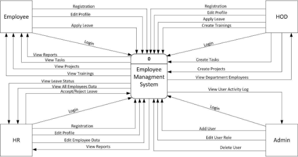

EMPLOYEE MANAGEMENT SYSTEM !

**EMPLOYEE MANAGEMENT SYSTEM** 

A project submitted to 

**UKA TARSADIA UNIVERSITY** 

In partial fulfillment of the requirements for the degree of 

**Bachelors of Science** 

in 

**Information Technology** 

for 

**5 Years Integrated M.Sc. (IT)** 

By 

**Abhishek Choksi** 

`      `(201906100110032) 

**Babu Madhav Institute of Information Technology** 

**Uka Tarsadia University** 

**Bardoli – 394350** 

**2020** 

201906100110032 

1
|||
| :- | :- |
||
EMPLOYEE MANAGEMENT SYSTEM 

**Table of Content** 
|
||
**Chapters** 

**Particulars** 

**Page No.**
|
|||||||
|||1 |**Introduction** |||
|||||||
||||1\.1  Problem definition |||
||||1\.2  Project Objective |||
||||1\.3  Project scope |||
|||||||
|||2 |**System specific requirements** |||
|||||||
||||2\.1  Functional requirement |||
||||2\.2  User characteristic |||
|||||||
|||3 |**System Analysis** |||
|||||||
||||3\.1  Questionnaires |||
||||3\.2  Data Flow Diagram |||
||||3\.2.1  Context level DFD |||
||||3\.2.2  Zero level DFD |||
||||3\.2.3  First level DFD (Any 2 major process) |||
|||||||
|||4 |**System Design** |||
|||||||
||||4\.1  Input Form (4 major process) |||
||||4\.2  Output form (4 major process) |||
||||
|||

EMPLOYEE MANAGEMENT SYSTEM !

**CHAPTER 3** 

**INTRODUCTION** 

**1.1  Problem definition** 

Manual handling of employee information poses a number of challenges. The use of paper work in handling some of these processes could lead to human error, papers may end up in the wrong hands and not forgetting the fact that this is time consuming. Another  challenge  is  that  multi-national  companies  will  have  all  the  employee information stored at the headquarters of the company making it difficult to access the employee information from remote places when needed at short notice. 

An  employee  management  system  managed  the  status  of  the  employee,  the educational  background  and  the  work  experience  in  order  to  help  monitor  the performance and achievements of the employee through a password protected system. 

**1.1  Project Objective** 

- Develop a well-designed database to store employee information. 
- Time and cost can be reduced by using the system. 
- A user friendly front-end for the user to interact with the system. 
- Easy retrieval of employee information. 
- Ability to sort employee queries by departments. 
- Remove details of employees no longer working in the organization. 

**1.3  Project scope** 

- Only people in the company can use the system. 
- Employees will have access to their personal profiles and will be able to edit. 
- The HR manager to accept/reject leave application through the system. 
- The admin will add an employee and a default password and employee id will be generated and sent to the new employee’s email. 
- The HR manager will then have the ability to add an employee’s information to the database 

EMPLOYEE MANAGEMENT SYSTEM !

**CHAPTER 4** 

**System specific requirements** 

1. **Functional requirement** 
- Registration 
- Authentication 
- Login 
- Logout 
- Login failure 
- Authorization 
- User Access Data 
- Display 
- Edit 
- Search 
- Update authentication
- Leave Application/Approval 
- Leave application 
- Leave approval 
- Leave days accrued 
- Recruitment 
- Add new employee 
- Add new user 
- Report generation 
- Project Management 
- Create project team 
- Work Breakdown Structure (WBS) 
- Trainings and Task Management 
2. **User characteristic** 
- Admin 
- Employee (could be lecturers, accountants, technicians) 
- Head of Department (HOD) 
- Human Resource (HR) 

201906100110032 

5

EMPLOYEE MANAGEMENT SYSTEM !

**CHAPTER 3 System Analysis** 

1. **Questionnaires** 

**Questionnaires structure: Funnel** 

|**Sr. No.** |***Questionnaires*** |**Question Type** |
| - | - | - |
|1\. |Sir, can you explain me about your company problem? |Open ended |
|2\. |Sir, what is the need of your company? |Open ended |
|3\. |
How much budget can your company afford for a website? I have four types of budgets: 

i. Above ₹1,00,000/- 

ii. Between ₹60,000/- to ₹1,00,000/- 

iii. Between ₹30,000/- to ₹59,000/- 
|Scale |
|4\. |Sir, what would you choose from the budget in the chart given? |Probe |
|5\. |Sir, would you mind if you had a little more budget than the one you chose? |Probe |
|6\. |Sir, can I suggest you more? |Bipolar |
|7\. |Sir, is the website you want for permanent use? |Bipolar |
|8\. |Sir, can my website be easily understood by your employee? |Bipolar |
|9\. |Sir, can I show the necessary rules  for employees in your company website? |Bipolar |
|10\. |Sir, can you tell me if your company has more information besides the information received from you? |Bipolar |
|11\. |Sir, it will take about 30 days for this website to be ready, do you mind? |Bipolar |
|12\. |Hello sir, how may I help you? |Close ended |
|13\. |Sir, can you tell me which of your staff will use the system you want? |Close ended |
EMPLOYEE MANAGEMENT SYSTEM !

|14\. |Sir, what information would you use to run a website for your company, Will you tell me? |Close ended |
| - | :- | - |
|15\. |Sir, what information  would  you  use  for  your  company's  head  of department, Will you tell me? |Close ended |
|16\. |Sir, what information  would  be  useful  for  your  company's  Human Resource, Will you tell me? |Close ended |
EMPLOYEE MANAGEMENT SYSTEM !

2. **Data Flow Diagram** 
1. **Context level DFD** 

**Fig. 3.2.1: Context level DFD** 

EMPLOYEE MANAGEMENT SYSTEM !

2. **Zero level DFD** 

**Fig. 3.2.2: Zero level DFD** 

EMPLOYEE MANAGEMENT SYSTEM !

3. **First level DFD** 

**Fig. 3.2.3 (i): Zero level DFD** 

**This figure describes the maintain Leave Application** 

EMPLOYEE MANAGEMENT SYSTEM !

**Fig. 3.2.3 (ii): Zero level DFD** 

**This figure describes the maintain Employee Details** 

EMPLOYEE MANAGEMENT SYSTEM !

**CHAPTER 4 System Design** 

1. **Input Form (4 major process)** 
- **Admin Login** 

EMPLOYEE MANAGEMENT SYSTEM !

- **Employee Login** 

EMPLOYEE MANAGEMENT SYSTEM !

- **Add Employee (Admin Panel)** 

EMPLOYEE MANAGEMENT SYSTEM !

EMPLOYEE MANAGEMENT SYSTEM !

- **Update Employee Info (Employee Panel)** 

EMPLOYEE MANAGEMENT SYSTEM !

- **Assign Project (Admin Panel)** 

EMPLOYEE MANAGEMENT SYSTEM !

- **Assign Project Mark (Admin Panel)** 

EMPLOYEE MANAGEMENT SYSTEM !

- **Leave Apply (Employee Panel)** 

EMPLOYEE MANAGEMENT SYSTEM !

2. **Output Form (4 major process)** 
- **Home Page** 

**Admin Panel : -** 

- **Admin Home Page** 

EMPLOYEE MANAGEMENT SYSTEM !

- **View Employee** 

- **Project Status** 

EMPLOYEE MANAGEMENT SYSTEM !

- **Employee Leave** 

EMPLOYEE MANAGEMENT SYSTEM !

**Employee Panel : -** 

- **Employee Home Page** 

EMPLOYEE MANAGEMENT SYSTEM !

- **My Profile** 

EMPLOYEE MANAGEMENT SYSTEM !

EMPLOYEE MANAGEMENT SYSTEM !

- **My Projects** 

EMPLOYEE MANAGEMENT SYSTEM !

- **Apply Leave** 

201906100110032 

26 
